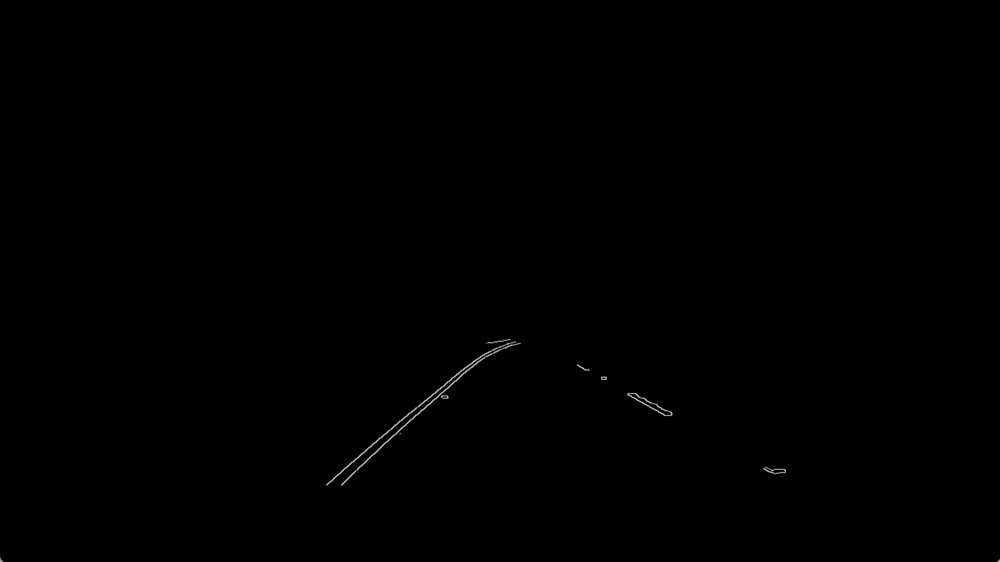
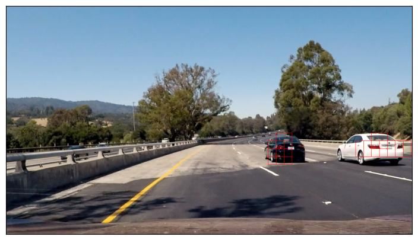

# CSE 455: Final Project

# Video Presentation

<iframe width="560" height="315" src="https://www.youtube.com/embed/s1yrNHE6b5Y" title="YouTube video player" frameborder="0" allow="accelerometer; autoplay; clipboard-write; encrypted-media; gyroscope; picture-in-picture; web-share" allowfullscreen></iframe>

# Problem

One of the most important and relevant applications of computer vision is in the context of Autonomous Driving. As we keep making progress in the fields of Artificial Intelligence and Machine Learning, Self-Driving Cars are no longer just a part of futuristic fiction. Many companies around the world such as Waymo, Cruise, and Tesla are investing hundreds and thousands of dollars into autonomous driving research and have begun rolling out fully- or semi-autonomous driving agents. While there are several approaches to implementing autonomous driving, one such approach is mounting an RGB-D camera atop a car to detect pedestrians and other vehicles in the car's vicinity so as to not only estimate the car's current state with respect to the map but also to classify possible obstacles that the car will have to watch out for or circumnavigate in the future. We plan to use vehicular imaging data and object detection data in a slightly unorthodox way to implement lane detection in the context of planning. The primary problem that we will be solving is detecting the lane in which lane the car is currently moving in and where any other cars in the vicinity are.

# Datasets

 The dataset that we used to train our model for this project was the [Udacity Self-Driving Car Dataset](https://public.roboflow.com/object-detection/self-driving-car).

The dataset consisted of ~8000 images of cars and ~8000 images of non-cars that we used to train a classifier which – given an image – could detect whether or not there was a car in the image.

# Set up

The set up for this project was fairly minimal. The Udacity dataset contained preprocessed and labelled images.

The set up was even simpler for lane tracking, as that was done purely through edge detection. All we needed was OpenCV installed and a video to test on.

# Methodology

## Lane Tracking

Lane tracking was done through edge detection. It followed a fairly standard Hough transform workflow in which each image was preprocessed, edge detected, applied to the Hough lines transform and the lines were overlaid on the original image.

The Hough Line transform is a default method provided by OpenCV. It’s a method that is used to detect straight lines. Since lanes are marked by straight lines, the idea behind this workflow is that we simply apply this standard transform to an input image. More information about this transform can be found [here](https://docs.opencv.org/3.4/d9/db0/tutorial_hough_lines.html).

However, there are two main problems with this:
1. Dashed lanes they will form many lines when we might only want one per side
2. The image can contain noise in the form of other objects with straight lines

Thankfully, there is an easy fix to both of the issues. To fix the multiple lines with dashed lane markers, all we really need to do is to form a “master line” that is calculated by taking the average of the slopes of all the lines on one side while using the most extreme points as the two end points.

To fix the other problem, all we would need to do is remove as many of the distractions as possible. This is done by simply masking the image to contain only a sliver in the middle, where the lane markings remain. Even so, there are many cases in which the line is jittery due to noise within that same location.

Thankfully, the fix for this was to simply increase the threshold for the Canny edge detection algorithm, which filtered out more of the lines. Check the final video out to see how it works now.

Even with this, there were several errors that we found when trying to detect lines on dashed roads. Particularly, when the lines were far enough apart, the Hough line transform was not able to identify lanes, which led to extreme jitteriness. Check [this video](https://youtu.be/vz3kCCF_Vrk) out.

Every other frame or so, the lane tracking would cut out due to being unable to detect the lines. Currently, we are getting around this by creating a “memory system” in which we extrapolate from the lane found in the previous frame. Just doing this led to a version in which we were able to keep decent tracking data throughout the entire video. Find that version [here](https://youtu.be/UmRVmtpJfyk).

By making the previous two changes, we ended with the final version.

Overall, the process in which the lanes were identified are:
1. Blur the image (in an attempt to get rid of errant lines)
2. Mask the image (to remove the useless bits of information)
3. Perform Canny edge detection (to get just the straight lines from the image)
4. Perform the Hough line transform
5. Clean up the lines

After applying the canny, we got the:


After the masking, we get:


After applying the Hough line transform and adding the lines to the original image, we get the final result:


Find the full video [here](https://youtu.be/s1yrNHE6b5Y)

Details of how this was applied can be found in the Github, linked above.

Applying both of these methods works remarkably well to detect lanes in most conditions. There are, however, a few limitations that we will mention later.

In performing research for this project, we have found that this methodology seems to be fairly standard in detecting lanes (at least in cases where machine learning was not used to detect lanes).


## Object Detection

When it came to the object detection aspect of this project, we were initially unsure of what approach would work best. We started off by using a haar cascade classifier to detect whether or not an image contained a car. However, even though this approach worked on simple images, it did not work too well in images that had multiple cars.
We thus decided to create a machine learning model and train it on the dataset mentioned above. Initially, we decided to use a Support Vector Machine and trained it on the Udacity Car dataset. However, even though the SVM performed very well on the test data (it got up to 99% accuracy) it performed very poorly on the input data, likely because during training, the model had overfit to the training data. Tuning the parameters for the SVM did show a little bit of improvement but not too much.
After doing some research, we found that for classification problems like the one we were trying to solve, a neural network was usually the best option. We then decided to experiment with the architecture of the neural network, and settled on the following:

```py
model = Sequential()
model.add(Conv2D(32, (3, 3), activation='relu', input_shape=(224, 224, 3)))
model.add(MaxPooling2D((2, 2)))
model.add(Conv2D(64, (3, 3), activation='relu'))
model.add(MaxPooling2D((2, 2)))
model.add(Conv2D(128, (3, 3), activation='relu'))
model.add(MaxPooling2D((2, 2)))
model.add(Flatten())
model.add(Dense(128, activation='relu'))
model.add(Dropout(0.5))
model.add(Dense(1, activation='sigmoid'))
```

We split the data we had into training, validation, and testing data and trained our model. We got 97% accuracy on the test data, which we were pretty happy with. The weights that we got after training our model can be found [here](https://drive.google.com/file/d/10eQ6x4AoKCAbmmtHoBpWQkfoUU4h6ssP/view?usp=sharing).
To apply the model to the actual input data, we decided to use a sliding window approach where each window was put through the model to see if the window contained a car or not. To capture cars that were further away in the scene as well as cars that were closer in the scene, we decided to use different-sized windows in the sliding window 

# Results

Lane tracking seems to be fairly accurate much of the time.

There are a few cases in which lane tracking fails, primarily at points in which there are discrepancies within the road itself, such as cracks, change in pavement type, and so on and so forth. There’s also a few frames in which the lane tracking algorithm failed altogether, due to either failing to detect a line for some odd reason or from failing to find an “average” line.

Usually, this tracking resulted in


But noise in the image in certain cases caused something like this instead

You can find a full video [here](https://youtu.be/s1yrNHE6b5Y)

The results for the object detection aspect of our project were pretty good as well. In addition to getting 97% accuracy on the test data, our model also did pretty well in identifying cars in the input images. The results were slightly poorer for frames in which there are a lot of shadows and extensive tree cover, but overall, the model does a fairly good job of classifying car vs non-car frames. Because we did not get enough time to merge the bounding boxes for overlapping windows, the final results appear closer to a heatmap of where cars actually are as opposed to perfect bounding boxes for those cars but we still find our model's results very satisfactory.

Upon combining this with the previous workflow, we start to get the following results:




Note that there are certain images where the lane tracking failed due to the distance between dashed lines.

## Limitations/Errors

There were several limitations that we found in implementing this project.

#### Lane Tracking
- Failure to detect curves
- Prone to getting confused by random lines detected by the edge detection algorithm

#### Object Detection
- While the sliding window approach that we used made our search very thorough, it slowed down the object detection process.
- Our decision to use a neural network meant that we got very good accuracy, but our predictions took a long time. This meant that it was infeasible for us to apply the object detection pipeline to constant video streams.
- Our decision to use different-sized sliding windows to capture cars both further away and closer in the scene meant that our sliding window algorithm took quite a bit of time, as for each frame, we had more windows to run the model predict() which took a very long time and made it so we could not extrapolate our algorithm to a constant video feed.

## Next Steps

One goal that we had for this project was to create an overall workflow that worked to do both lane tracking and object detection and to use the conjunction of this data to identify whether there was an object in the current lane. While we were able to get the workflows to work together, we ran out of time to perform the third step of identifying which cars are in the current lane. 

### Lane Tracking

The main next steps for lane tracking is to include functionality to detect curves in the road and to further tune the processing in order to get rid of unwanted noise/consistently lane track. 

While we are not certain on how to implement curves, we have an idea on how to detect curves. If we were able to instead get a top-down view of the road, it would be much easier to detect the edges of a curved lane with Canny and to fit a line along this instead. It may even be possible with the video we used for this project by simply doing a perspective transform.

### Object Detection

Because of the sliding window algorithm that is currently being used, the final result contains bounding boxes of different scales for a given car. As such, we currently have more of a heatmap of where in the scene a car potentially is rather than an accurate bounding box for the car. One improvement we could make in the future would be to merge the bounding boxes for a given car and create a singular bounding box for the entire car. 
Another potential improvement we could make would be to speed up the prediction process. Right now, even though the model has been trained well and is fairly accurate in predicting whether a given image contains a car, the prediction process takes a long time. While we are unsure of how we would do this, speeding up the prediction process across all the sliding windows would mean that we could test our algorithm and model on live video streams. 
Finally, another improvement we could make is improving the model's performance in bad lighting conditions and in the presence of trees. This could be done by obtaining more information of what a non-vehicle looks like.
